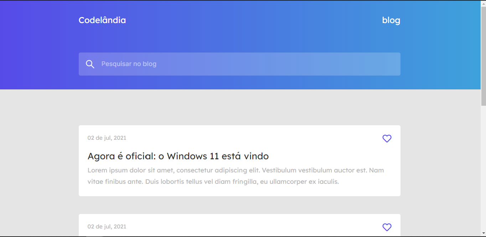

  

<h1 align="center">Codelândia | blog</h1>

  🚧---- EM CONSTRUÇÃO!!! ----🚧

<h2 align="center">Descrição</h2>

  Primeiro desafio da Comunidade Codelândia 

 
 

 <a href="#descricao">Descricão</a> •
 <a href="#tecnologias">Tecnologias</a> •

## 🛠️ Tecnologias

Principais tecnologias utilizadas no desenvolvimento do projeto:

- [Scss](https://sass-lang.com/)

